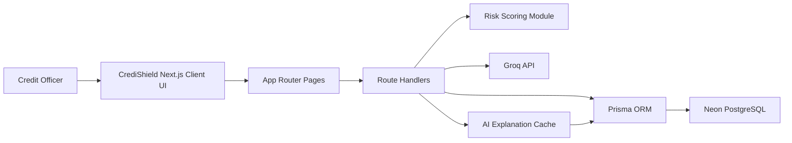
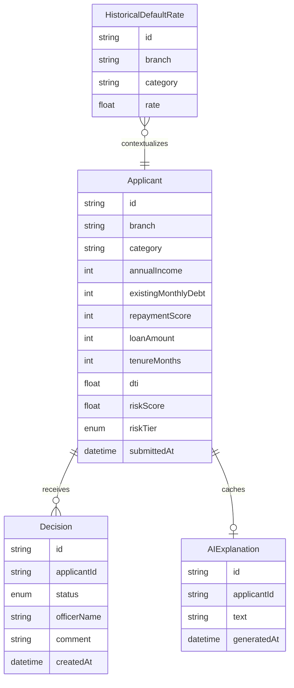

# CrediShield: AI-Powered Bank Loan Default Risk & Credit Intelligence Platform

<p align="center">
  <strong>AI-Powered Bank Loan Default Risk & Credit Intelligence Platform for portfolio monitoring, AI explanations, applicant review, CSV ingest, and decision audit trails.</strong>
</p>

<p align="center">
  
  
  
  
  
  
</p>

## Overview

CrediShield is a full-stack bank loan default risk and credit intelligence platform built with the Next.js App Router. It ingests applicant profiles, computes and stores default-risk scores, ranks borrowers for officer review, visualizes portfolio exposure, generates cached Groq-powered credit explanations, and preserves every approval workflow action in an auditable decision log.

The project is designed for portfolio review, AI/ML evaluation, hackathon judging, and recruiter screening. The backend focuses on deterministic risk scoring and durable storage; the frontend presents the workflow like a polished fintech product.

## Screenshots

> Add CrediShield screenshots after Vercel deployment.

| Portfolio Dashboard | Applicant Queue | Credit Profile |
| --- | --- | --- |
| `docs/screenshots/dashboard.png` | `docs/screenshots/queue.png` | `docs/screenshots/applicant.png` |

| Decision Log | CSV Import |
| --- | --- |
| `docs/screenshots/log.png` | `docs/screenshots/import.png` |

## Core Features

- Portfolio dashboard with KPI cards, risk alerting, exposure analytics, recent decisions, and default-rate heatmap.
- Applicant queue with risk-tier filtering, branch/category filters, sorting, search, status pills, and score progress indicators.
- CRM-style applicant profile with financial summary, DTI, stored risk score, decision workflow, AI memo, and timeline.
- Groq-powered AI credit explanations with cached intelligence per applicant.
- CSV import workflow with client-side schema validation, preview, and server-side scoring on insert.
- Decision log with officer, status, date filters, local search, and activity-feed presentation.
- Prisma-backed Neon PostgreSQL persistence with migrations and seed data.
- GitHub Actions workflow and production deployment notes.

## Architecture



## Data Model Overview



## Risk Formula

Risk is computed on the server when an applicant is created or imported. Reads use the stored score to keep dashboards deterministic.

```text
DTI = existingMonthlyDebt / (annualIncome / 12)
riskScore = clamp(0.55 * (DTI * 100) + 0.45 * (100 - repaymentScore), 0, 100)
```

| Tier | Score Range | Meaning |
| --- | --- | --- |
| Low | `< 35` | Healthy debt load and repayment behavior |
| Medium | `35-65` | Needs officer review and contextual checks |
| High | `> 65` | Elevated default risk and tighter approval scrutiny |

## Tech Stack

| Layer | Technology | Purpose |
| --- | --- | --- |
| Framework | Next.js 14 App Router | Pages, layouts, API route handlers |
| Language | TypeScript | Type-safe frontend and backend code |
| Styling | Tailwind CSS | Responsive fintech UI system |
| Database | Neon PostgreSQL | Serverless Postgres persistence |
| ORM | Prisma | Schema, migrations, generated client |
| AI | Groq API | Credit explanation generation |
| Charts | Recharts | Portfolio exposure visualization |
| CSV | PapaParse | Browser-side CSV parsing and validation |
| CI | GitHub Actions | Automated verification |

## Folder Structure

```text
app/
  api/                         Next.js route handlers
  applicants/[id]/page.tsx     Applicant profile and decision workflow
  import/page.tsx              CSV import experience
  log/page.tsx                 Decision activity feed
  queue/page.tsx               Applicant review queue
  page.tsx                     Portfolio dashboard
components/
  Badge.tsx                    Risk and status pills
  ExposureChart.tsx            Recharts exposure visualization
  LoadingState.tsx             Loading and error UI
  Nav.tsx                      Sticky product navigation
  RiskGauge.tsx                Risk progress component
lib/
  api.ts                       API error helpers
  prisma.ts                    Prisma client singleton
  risk.ts                      Risk scoring and status utilities
  types.ts                     Shared branch/category/tier constants
prisma/
  schema.prisma                Database models
  seed.ts                      Demo dataset
```

## API Reference

| Method | Route | Description |
| --- | --- | --- |
| `GET` | `/api/portfolio/summary` | Portfolio KPIs, exposure chart data, and high-risk alert. |
| `GET` | `/api/historical-rates` | Historical default rates by branch and loan category. |
| `GET` | `/api/applicants` | Filtered applicant queue. Supports `tier`, `category`, `branch`, and `sort`. |
| `POST` | `/api/applicants` | Create one or many applicants from validated rows. |
| `GET` | `/api/applicants/[id]` | Applicant profile, decisions, and cached AI explanation. |
| `POST` | `/api/applicants/[id]/decision` | Record an officer decision. |
| `POST` | `/api/applicants/[id]/explain` | Generate or refresh a Groq-backed explanation cache. |
| `GET` | `/api/decisions` | Decision log. Supports `officer`, `status`, `from`, and `to`. |

## Environment Variables

| Variable | Required | Description |
| --- | --- | --- |
| `DATABASE_URL` | Yes | Neon pooled PostgreSQL connection string. |
| `GROQ_API_KEY` | Yes for AI | Groq API key used by CrediShield AI credit explanations. |
| `HIGH_RISK_THRESHOLD_PERCENT` | No | Dashboard alert threshold. Defaults to `20`. |

## Local Setup

```bash
npm install
npx prisma migrate dev
npm run seed
npm run dev
```

Open `http://localhost:3000`.

## CSV Import Contract

The `/import` page accepts `.csv` files with these required columns:

```text
branch,category,annualIncome,existingMonthlyDebt,repaymentScore,loanAmount,tenureMonths
```

Rows are parsed in the browser, validated for required columns, and posted to `/api/applicants`. Server-side validation protects numeric fields before Prisma writes the records.

## Deployment

1. Create a Neon database and copy the pooled `DATABASE_URL`.
2. Create a Groq API key and set `GROQ_API_KEY`.
3. Add environment variables in Vercel.
4. Deploy from GitHub.
5. Run Prisma migration and seed against the production database if demo records are desired.

See `DEPLOY.md` for the concise deployment checklist.

## Future Roadmap

- Role-based access for credit officers and admins.
- Batch import error export for invalid CSV rows.
- Model monitoring page for drift and approval-rate trends.
- Applicant document upload and underwriting checklist.
- Explainability comparison between deterministic formula and AI memo.
- Exportable PDF credit memo for approved applications.

## Author

CrediShield was built by Noel J as a production-quality AI/ML fintech portfolio project for college evaluation, hackathons, and recruiter review.
