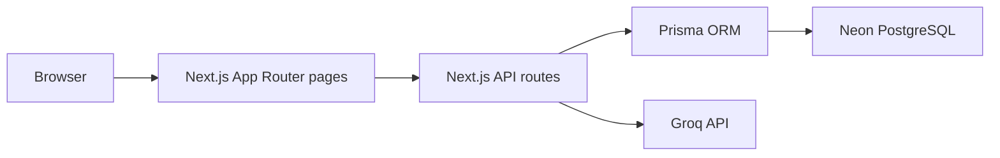

# Bank Loan Default Risk & Credit Intelligence Platform

Full-stack Next.js application for a college AI/ML credit-risk project. It stores applicant profiles in PostgreSQL through Prisma, computes default-risk scores on ingest, ranks applications for officer review, logs decisions, and generates cached Groq-powered risk explanations.

## Before running

Paste these values into `.env` before end-to-end local use:

- `DATABASE_URL`: Neon pooled PostgreSQL connection string from the Neon console.
- `GROQ_API_KEY`: Groq API key from the Groq console.

Without real credentials, the project can still install, type-check, generate Prisma Client, and build. DB writes, seeded data reads, CSV imports, dashboard live data, decision logging, and AI explanation calls require a real Neon database. Groq explanations additionally require `GROQ_API_KEY`.

## Local setup

```bash
npm install
npx prisma migrate dev
npm run seed
npm run dev
```

Open `http://localhost:3000`.

## Scoring formula

Risk is computed server-side during applicant creation/import and stored in the database. Reads use stored values only.

```text
DTI = existingMonthlyDebt / (annualIncome / 12)
riskScore = clamp(0.55 * (DTI * 100) + 0.45 * (100 - repaymentScore), 0, 100)
```

Risk tiers:

- Low: `< 35`
- Medium: `35-65`
- High: `> 65`

## CSV import

The `/import` page accepts CSV files with these required columns:

```text
branch,category,annualIncome,existingMonthlyDebt,repaymentScore,loanAmount,tenureMonths
```

Rows are parsed with PapaParse in the browser, validated for required columns, then posted to `/api/applicants`, where risk values are computed and persisted.

## Routes

- `/`: portfolio dashboard with KPIs, high-risk alert, exposure chart, and default-rate heatmap.
- `/queue`: sortable and filterable applicant queue.
- `/applicants/[id]`: applicant profile, score breakdown, cached AI explanation, decision form, and applicant-specific history.
- `/log`: full decision log with officer, status, and date filters.
- `/import`: CSV batch import flow.

## Architecture



## Notes

- `HIGH_RISK_THRESHOLD_PERCENT` can be set to override the default dashboard alert threshold of `20`.
- TODO: The referenced `./reference/loan-risk-dashboard.jsx` file was not present in this workspace, so the implementation follows the visual description from the brief.
